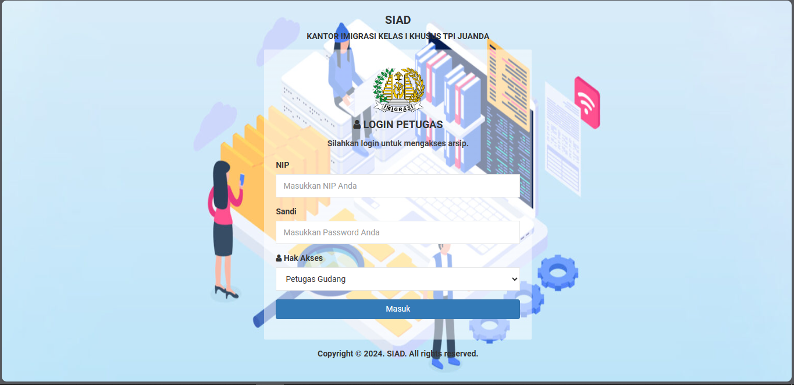

# 📁 Sistem Informasi Arsip Digital - Kantor Imigrasi

Sistem Informasi Arsip Digital ini dirancang khusus untuk membantu pengelolaan dokumen fisik di kantor imigrasi secara **tertib, terstruktur, dan efisien**. 
Sistem ini mengelola penomoran berkas secara otomatis berdasarkan **lokasi fisiknya** 
seperti lemari, loker, dan nomor arsip, sehingga mempermudah pencarian dan pelacakan dokumen.

---

## ✨ Fitur Unggulan

✅ Penomoran berkas otomatis berdasarkan:

- **Lemari**
- **Loker**
- **Nomor berkas unik**

✅ Pencarian dan pelacakan berkas cepat  
✅ Input data arsip berbasis web  
✅ Responsive design (bisa diakses via desktop/tablet)  
✅ Tampilan sederhana dan ramah pengguna  
✅ Riwayat aktivitas dan log penggunaan  
✅ Manajemen pengguna dengan hak akses

---

## 🛠️ Teknologi yang Digunakan

| Teknologi | Deskripsi |
|----------|------------|
|  | Backend utama |
|  | Database relasional |
|  | Local development |
|  | UI responsif |

---

## 🖼️ Screenshot Aplikasi

### 🧾 Tampilan Dashboard

🚀 Cara Menjalankan Aplikasi

1. Clone atau copy project ke folder htdocs XAMPP:
	cp -r arsip-digital /xampp/htdocs/

2. Jalankan XAMPP (Apache & MySQL)
	
3. Import database:
	- Buka phpMyAdmin
	- Buat database: arsip_digital
	- Import file SQL dari folder database/arsip_digital.sql

4. Konfigurasi koneksi database di config/koneksi.php:
	$host = 'localhost';
	$user = 'root';
	$pass = '';
	$db   = 'arsip_digital';
	
5. Akses aplikasi via browser:
	- http://localhost/siad
	
	
🧑‍💻 Kontribusi
Pull request dan saran pengembangan sangat disambut! Jangan ragu untuk fork dan modifikasi proyek ini.

📃 Lisensi
Proyek ini bersifat open-source dan dapat digunakan untuk pembelajaran atau pengembangan lebih lanjut. 
Silakan cantumkan kredit kepada pengembang asli bila digunakan secara publik.

🙋‍♂️ Kontak Pengembang
📧 Email: [yudyasukma2@gmail.com]